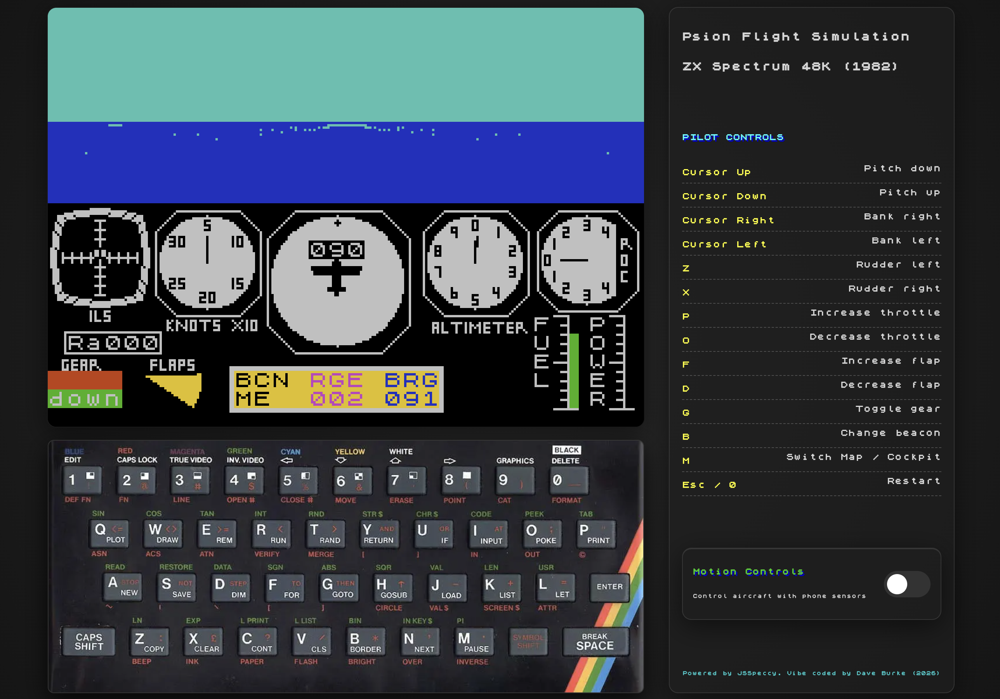

### ZX Spectrum Flight Simulation 1982 in Chrome



## About

Vibe coding fun with Google Antigravity! Brought ZX Spectrum Flight Simulation 1982 from my childhood back to life in Chrome. With virtual skeuomorphic keyboard, accel / gyro for phone, sounds effects (the original game had none). Claude Code w/ gcloud-mcp to deploy to Google Cloud. Happy flying! 

Live link: https://zxflightsim-613948574792.us-central1.run.app/

More info on this game: https://en.wikipedia.org/wiki/Flight_Simulation_(Psion_software). 

## Getting Started

To run locally

```bash
npm run dev
```

Open [http://localhost:3000](http://localhost:3000) with your browser to see the result.


